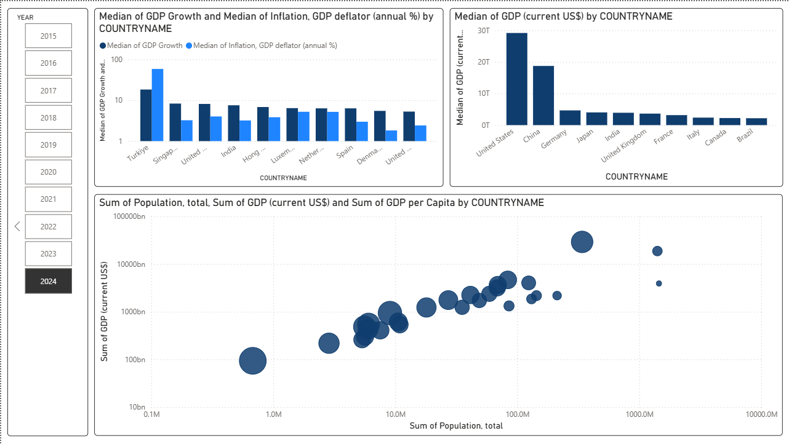
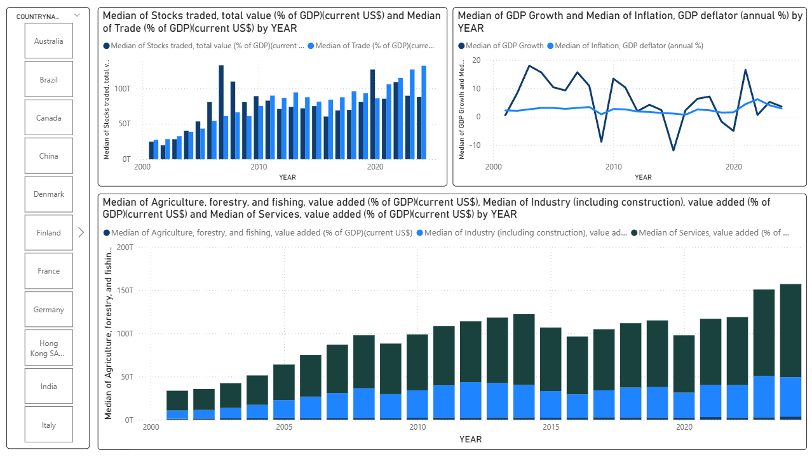

# Word Development Indicator – ELT Analytics Platform

## Project Summary
This project consists of designing and implementing an ELT data pipeline using Kafka for ingestion, dbt for transformation and modeling, and Snowflake as the cloud data warehouse. The objective is to centralize and standardize multiple global economic indicators in order to analyze worldwide development patterns using Power BI dashboards.

---

## Technology Stack

| Layer                     | Technology    |
|---------------------------|---------------|
| Data Ingestion            | Kafka Connect |
| Transformation & Modeling | dbt           |
| Cloud Data Warehouse      | Snowflake     |
| BI & Analytics            | Power BI      |

---

## Data Source

Dataset: World Development Indicators (World DataBank)

The dataset includes a wide range of macroeconomic and socio-economic indicators across multiple countries and time periods. Examples include:
- GDP and GDP per capita
- GDP growth rate
- Inflation rate
- Trade balance and export/import ratios
- Sector contribution (Agriculture, Industry, Services)
- Additional country-level development KPIs

---

## Power BI Dashboards

Two Power BI dashboard pages are developed to present the structured indicators sourced from Snowflake:

Global Comparison of countries's GDP, GDP per Capita

Detailled View of a Country's overall economy, inflation, trade and sectors contribution

## Analytical Insights

1. Countries with the highest GDP do not necessarily have the highest GDP per capita, showing that economic size does not correlate directly with average citizen wealth.
2. Leading GDP countries are not always those with the fastest GDP growth rate, indicating varying stages of economic maturity.
3. There is a global trend showing increased contribution from the services sector, particularly in developed and emerging economies.
4. Trade dynamics and international exchange levels have noticeable influence on GDP growth patterns.

---

